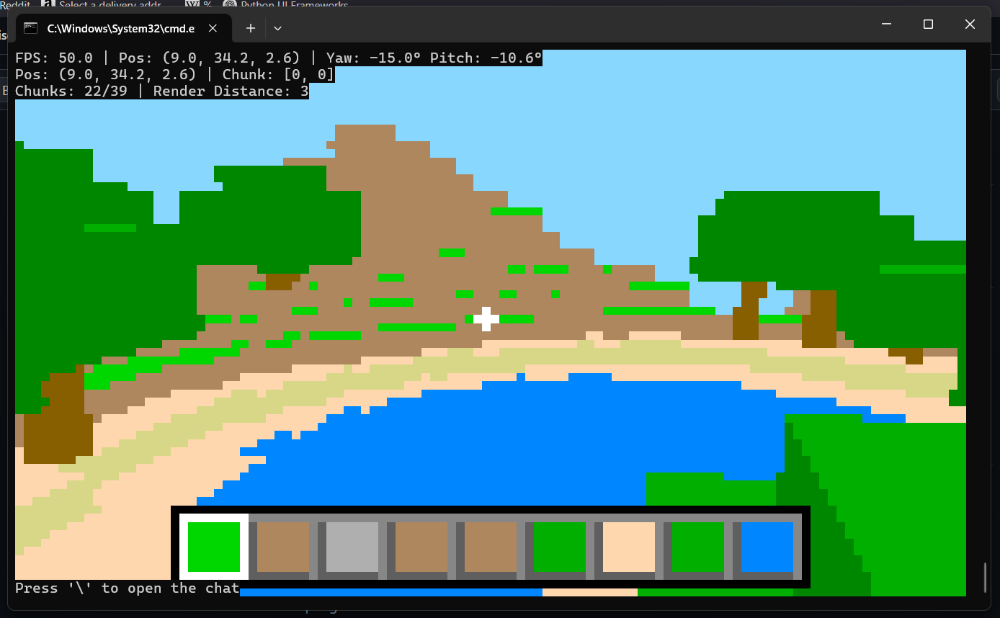
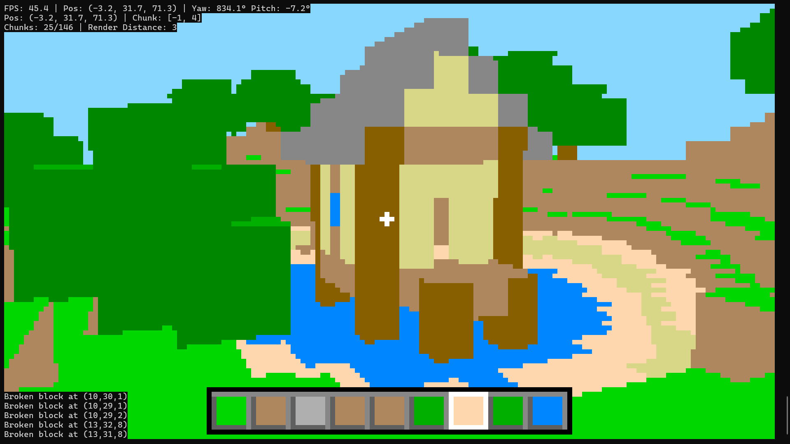
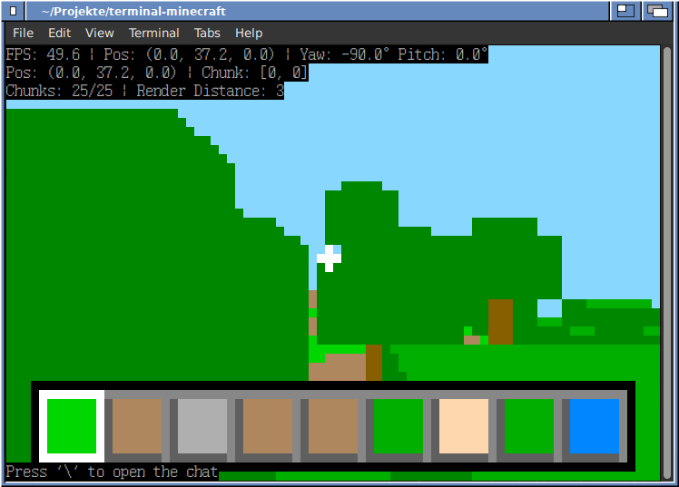
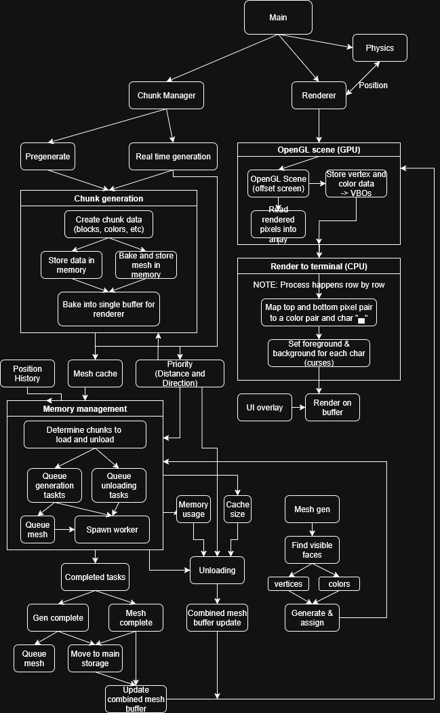

# terminal-minecraft
Simple minecraft clone but it runs in the terminal.
Works by using the foreground+background trick with the half block character ("▄"), simulating two "pixels" per terminal character.
As much as i tried to optimize it, it requires a decent cpu to run "normally", if you have a low-end pc, please check the settings and update the optimization values accordingly.
Since the render is what causes most spikes, consider changing the render distance and increase the terminal font size for quick testing, though I recommend checking out the settings.
Additionally, if you have above-medium / high end harware, also change the settings to the high ones for faster calculations, generation and rendering etcetc

# showcase




*windows windowed gameplay  /  fullscreen (with my lagoon hut, very pretty i know)  /  \*NIX style operating system with X11*

NOTE: Beware that quality scales up with the window size and font size, but so does the impact on the cpu!

# installation


# usage

On windows, run the program inside a terminal with this command:
```
> python main.py
```

On unix-like operating systems, ensure you are in an X11 session (wayland is not supported, xwayland is untested, may not work) and run the program inside a terminal with this command:
```
$ python3 main.py 2> debug_log.txt
```
(the `2>` is a shell redirect for redirecting stderr into a log file. this not only logs errors but also keeps the terminal clean while playing. without this, all logging data would overlap onto the gameplay and cause visual issues.)

# controls
* W A S D : movement
* mouse | arrow keys : camera look
* space : jump
* mouse buttons, INS/DEL : place/break blocks
* ESC : close  ( cleanup may take a few seconds )
* TAB : toggle flight mode
* C : move down

**Notice:** Beware that the mouse (on X11 the keyboard too) will be thread locked when chunk pregeneration finishes and will only be released when the program is closed


# updates
v 1.0.0 : Basic Clone with curses rendering
* Showcase: https://www.youtube.com/watch?v=9djN_DJn6x0&t
* Procedural chunk generation ( 2 biomes : plains, forest )
* Cave and tree generation (mostly random)
* Windows curses render from opengl context
* Primitive mouse draw controller
* WASD controller and keylisteners
* Voxel culling and frustum
* total of 10 block types

v 1.2.0
* Showcase: https://www.youtube.com/watch?v=7TLsNwHLdWw&t
* Smoother and lazyer chunk generation, load and unloading
* Mesh caching and faster mesh updates
* Block placement/breaking/selection
* Block hotbar
* Support for more color combinations
* Improved optimization settings for low-medium end pcs
* Decent mouse look controller
* Logo title thingy

v 1.2.1  ( CURRENT )
* Repository cleanup
* Input handling support for X11-based systems (*nix operating systems / linux)
* Camera movement via arrow keys support
* Block breaking and placing via keyboard support

# todo
* ✗ Add dirty chunk memory
* ✗ Add world save and load features
* ✓ Fix stupid ahh raytrace offsets
* ✓ Reduce memory load on mesh render
* ✓ Cache colors and rendered data, draw only changes
* ✓ Cache rencently visited world data
* ✓ Use lazy, position based generatiors with priority for less intense generation
* ✓ Fix color combination out of bounds artifacts
* ✗ Add an actuall title screen
* ✗ Add propper gui like pause menu, settings, etc
* ✗ Add an actuall chat and achievements
* ✗ Fix water broken face culling at chunk edges
* ✗ Paint x,-x and z,-z faces of different colors to distinguish them
* ✓ Block hotbar
* ✗ Improved on preformance and caching


# diagram

